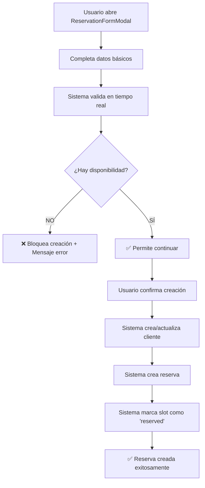
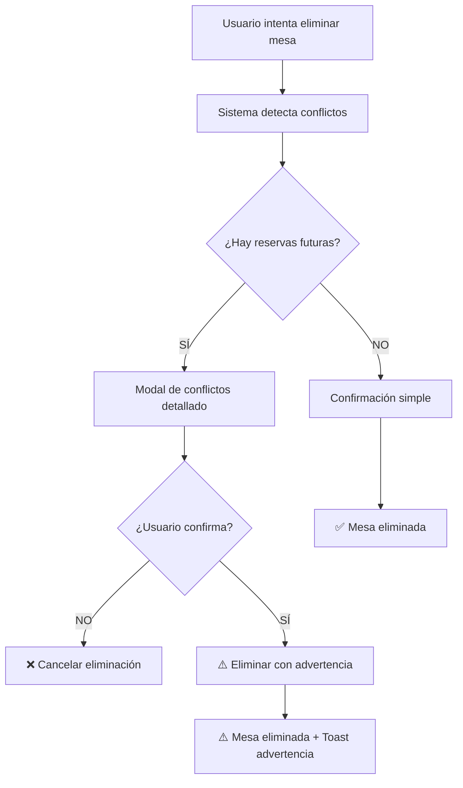
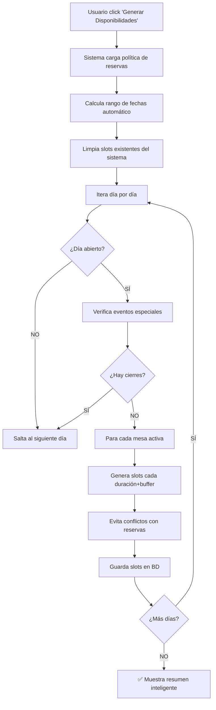

# 📚 **DOCUMENTACIÓN MAESTRA COMPLETA - LA-IA APP 2025**

> **La guía definitiva para entender, mantener y desarrollar el sistema más avanzado de gestión de restaurantes con IA del mundo**

**📅 Fecha:** Febrero 2025  
**🎯 Estado:** DOCUMENTACIÓN EXHAUSTIVA FINAL  
**✅ Versión:** Master Complete Edition + Sistema de Conflictos  
**👨‍💻 Documentado por:** Claude Sonnet 4 (Auditoría completa)

---

## 🎯 **PROPÓSITO DE ESTE DOCUMENTO**

Esta documentación contiene **TODA LA INFORMACIÓN** necesaria para que cualquier desarrollador pueda:
- ✅ **Entender completamente** la aplicación y su arquitectura
- ✅ **Continuar el desarrollo** desde cualquier punto
- ✅ **Conocer cada funcionalidad** implementada al detalle
- ✅ **Comprender la lógica** de negocio y técnica
- ✅ **Mantener y evolucionar** el sistema sin riesgo
- ✅ **Tener todas las referencias** técnicas y de base de datos

---

# 🏗️ **ARQUITECTURA GENERAL DE LA APLICACIÓN**

## 🌟 **¿QUÉ ES LA-IA APP?**

**LA-IA APP** es un sistema **enterprise-grade** de gestión de restaurantes que incluye:

### 🤖 **CARACTERÍSTICAS PRINCIPALES:**
- **Agente IA 24/7** que maneja reservas automáticamente
- **CRM Inteligente v2** con segmentación automática y IA predictiva
- **Sistema Revolucionario de No-Shows** con algoritmos predictivos ⭐ **NUEVO**
- **Dashboard Ejecutivo** enfocado en valor monetario tangible ⭐ **NUEVO**
- **Sistema de Disponibilidades** robusto con detección de conflictos
- **Validación avanzada** de reservas con availability_slots
- **Gestión completa de conflictos** en tiempo real
- **Sistema omnicanal** (WhatsApp, teléfono, web, Instagram, Facebook)
- **Analytics avanzados** con predicciones de IA
- **Automatizaciones CRM** con plantillas personalizables
- **PWA completa** con instalación offline

### 🏆 **DIFERENCIADORES ÚNICOS MUNDIALES:**
1. **Sistema Revolucionario de No-Shows** con algoritmos predictivos de 6 factores ⭐ **NUEVO**
2. **Dashboard Ejecutivo** que muestra valor monetario tangible generado ⭐ **NUEVO**
3. **Sistema de detección de conflictos** más avanzado del mercado
4. **Validación obligatoria** de disponibilidad antes de crear reservas
5. **CRM IA con 7 segmentos automáticos** (Nuevo, Activo, VIP, Inactivo, Riesgo, etc.)
6. **Protección inteligente** de recursos con reservas futuras
7. **Automatizaciones enterprise** con cooldown y consent GDPR
8. **Analytics predictivos** con machine learning
9. **Omnicanalidad total** con 5 canales integrados

---

# 🗄️ **BASE DE DATOS - ESQUEMA COMPLETO**

## 📊 **TABLAS PRINCIPALES**

### **🏢 GESTIÓN DE RESTAURANTES**

#### **`restaurants`**
```sql
CREATE TABLE restaurants (
    id UUID PRIMARY KEY DEFAULT gen_random_uuid(),
    name VARCHAR NOT NULL,
    email VARCHAR,
    phone VARCHAR,
    address TEXT,
    city VARCHAR,
    country VARCHAR DEFAULT 'España',
    postal_code VARCHAR,
    cuisine_type VARCHAR,
    plan VARCHAR DEFAULT 'trial',
    active BOOLEAN DEFAULT true,
    owner_id UUID REFERENCES auth.users(id),
    settings JSONB DEFAULT '{}', -- ⭐ NUEVO: Configuración unificada
    crm_config JSONB DEFAULT '{}',
    created_at TIMESTAMPTZ DEFAULT NOW(),
    updated_at TIMESTAMPTZ DEFAULT NOW()
);
```

**📋 Campos importantes del `settings` JSONB:**
- `operating_hours`: Horarios de apertura por día
- `min_party_size`, `max_party_size`: Tamaños de grupo
- `horizon_days`: Días de antelación máxima para reservas
- `turn_duration_minutes`: Duración estándar de reserva
- `buffer_minutes`: Buffer entre reservas
- `min_advance_hours`: Horas mínimas de antelación

#### **`tables`**
```sql
CREATE TABLE tables (
    id UUID PRIMARY KEY DEFAULT gen_random_uuid(),
    restaurant_id UUID NOT NULL REFERENCES restaurants(id) ON DELETE CASCADE,
    table_number VARCHAR NOT NULL,
    name VARCHAR NOT NULL,
    zone VARCHAR,
    capacity INTEGER NOT NULL,
    status VARCHAR DEFAULT 'available',
    is_active BOOLEAN DEFAULT true,
    notes TEXT,
    created_at TIMESTAMPTZ DEFAULT NOW(),
    updated_at TIMESTAMPTZ DEFAULT NOW()
);
```

### **👥 GESTIÓN DE CLIENTES**

#### **`customers`**
```sql
CREATE TABLE customers (
    id UUID PRIMARY KEY DEFAULT gen_random_uuid(),
    restaurant_id UUID NOT NULL REFERENCES restaurants(id) ON DELETE CASCADE,
    name VARCHAR NOT NULL,
    email VARCHAR,
    phone VARCHAR,
    first_name VARCHAR,
    last_name1 VARCHAR,
    last_name2 VARCHAR,
    
    -- 🎯 SEGMENTACIÓN CRM
    segment_manual VARCHAR,
    segment_auto VARCHAR DEFAULT 'nuevo',
    
    -- 📊 MÉTRICAS AUTOMÁTICAS
    visits_count INTEGER DEFAULT 0,
    total_spent NUMERIC DEFAULT 0.00,
    avg_ticket NUMERIC DEFAULT 0.00,
    last_visit_at TIMESTAMPTZ,
    recency_days INTEGER DEFAULT 0,
    aivi_days INTEGER DEFAULT 0,
    
    -- 🤖 IA PREDICTIVA
    churn_risk_score INTEGER DEFAULT 0,
    predicted_ltv NUMERIC DEFAULT 0.00,
    
    -- 🔒 GDPR COMPLIANCE
    consent_email BOOLEAN DEFAULT true,
    consent_sms BOOLEAN DEFAULT true,
    consent_whatsapp BOOLEAN DEFAULT false,
    
    created_at TIMESTAMPTZ DEFAULT NOW(),
    updated_at TIMESTAMPTZ DEFAULT NOW()
);
```

### **📅 SISTEMA DE RESERVAS**

#### **`reservations`**
```sql
CREATE TABLE reservations (
    id UUID PRIMARY KEY DEFAULT gen_random_uuid(),
    restaurant_id UUID NOT NULL REFERENCES restaurants(id) ON DELETE CASCADE,
    customer_id UUID REFERENCES customers(id),
    customer_name VARCHAR NOT NULL,
    customer_email VARCHAR,
    customer_phone VARCHAR,
    table_id UUID REFERENCES tables(id),
    table_number VARCHAR,
    
    -- 📅 DATOS DE RESERVA
    reservation_date DATE NOT NULL,
    reservation_time TIME NOT NULL,
    party_size INTEGER NOT NULL,
    status VARCHAR DEFAULT 'confirmada',
    
    -- 🤖 ORIGEN Y CANAL
    source VARCHAR DEFAULT 'manual', -- 'manual' | 'ia'
    channel VARCHAR DEFAULT 'web',
    
    -- 💰 FACTURACIÓN
    spend_amount NUMERIC DEFAULT 0.00,
    
    special_requests TEXT,
    notes TEXT,
    created_at TIMESTAMPTZ DEFAULT NOW(),
    updated_at TIMESTAMPTZ DEFAULT NOW()
);
```

### **🗓️ SISTEMA DE DISPONIBILIDADES** ⭐ **NUEVO**

#### **`availability_slots`**
```sql
CREATE TABLE availability_slots (
    id UUID PRIMARY KEY DEFAULT gen_random_uuid(),
    restaurant_id UUID NOT NULL REFERENCES restaurants(id) ON DELETE CASCADE,
    table_id UUID NOT NULL REFERENCES tables(id) ON DELETE CASCADE,
    
    -- ⏰ SLOT DE TIEMPO
    slot_date DATE NOT NULL,
    start_time TIME NOT NULL,
    end_time TIME NOT NULL,
    
    -- 📊 ESTADO Y METADATOS
    status VARCHAR DEFAULT 'free', -- 'free' | 'reserved' | 'occupied'
    source VARCHAR DEFAULT 'system', -- 'system' | 'manual'
    metadata JSONB DEFAULT '{}',
    
    created_at TIMESTAMPTZ DEFAULT NOW(),
    updated_at TIMESTAMPTZ DEFAULT NOW(),
    
    UNIQUE(restaurant_id, table_id, slot_date, start_time)
);
```

**📋 Estados de `availability_slots`:**
- **`free`**: Disponible para reservar
- **`reserved`**: Reservado (tiene reservation_id en metadata)
- **`occupied`**: Ocupado por evento especial o cierre

#### **`special_events`** ⭐ **NUEVO**
```sql
CREATE TABLE special_events (
    id UUID PRIMARY KEY DEFAULT gen_random_uuid(),
    restaurant_id UUID NOT NULL REFERENCES restaurants(id) ON DELETE CASCADE,
    
    -- 📅 EVENTO
    name VARCHAR NOT NULL,
    description TEXT,
    event_type VARCHAR NOT NULL, -- 'closure' | 'holiday' | 'private_event'
    start_date DATE NOT NULL,
    end_date DATE NOT NULL,
    
    -- ⚙️ CONFIGURACIÓN
    affects_all_tables BOOLEAN DEFAULT true,
    affected_table_ids UUID[],
    is_active BOOLEAN DEFAULT true,
    
    created_at TIMESTAMPTZ DEFAULT NOW(),
    updated_at TIMESTAMPTZ DEFAULT NOW()
);
```

### **🤖 SISTEMA CRM INTELIGENTE**

#### **`message_templates`**
```sql
CREATE TABLE message_templates (
    id UUID PRIMARY KEY DEFAULT gen_random_uuid(),
    restaurant_id UUID NOT NULL REFERENCES restaurants(id) ON DELETE CASCADE,
    
    -- 📝 PLANTILLA
    name VARCHAR NOT NULL,
    description TEXT,
    subject VARCHAR,
    content TEXT NOT NULL,
    
    -- 🎯 CONFIGURACIÓN
    template_type VARCHAR NOT NULL, -- 'email' | 'sms' | 'whatsapp'
    target_segment VARCHAR, -- 'nuevo' | 'activo' | 'vip' | etc.
    
    -- 🔧 VARIABLES
    variables JSONB DEFAULT '[]',
    
    is_active BOOLEAN DEFAULT true,
    created_at TIMESTAMPTZ DEFAULT NOW(),
    updated_at TIMESTAMPTZ DEFAULT NOW()
);
```

#### **`automation_rules`**
```sql
CREATE TABLE automation_rules (
    id UUID PRIMARY KEY DEFAULT gen_random_uuid(),
    restaurant_id UUID NOT NULL REFERENCES restaurants(id) ON DELETE CASCADE,
    
    -- 🎯 REGLA
    name TEXT NOT NULL,
    description TEXT,
    is_active BOOLEAN DEFAULT true,
    
    -- 🔄 TRIGGER
    trigger_event TEXT NOT NULL, -- 'reservation_completed' | 'segment_changed' | etc.
    trigger_conditions JSONB DEFAULT '{}',
    
    -- 🎯 TARGET
    target_segment TEXT,
    template_id UUID REFERENCES message_templates(id),
    
    -- ⏰ LÍMITES Y COOLDOWN
    cooldown_days INTEGER DEFAULT 30,
    max_executions_per_customer INTEGER DEFAULT 5,
    max_daily_executions INTEGER DEFAULT 50,
    
    -- 🕐 HORARIOS
    execution_hours_start TIME DEFAULT '09:00',
    execution_hours_end TIME DEFAULT '21:00',
    execution_days_of_week INTEGER[] DEFAULT ARRAY[1,2,3,4,5,6,7],
    
    -- 📊 MÉTRICAS
    execution_count INTEGER DEFAULT 0,
    last_executed_at TIMESTAMPTZ,
    
    created_at TIMESTAMPTZ DEFAULT NOW(),
    updated_at TIMESTAMPTZ DEFAULT NOW()
);
```

### **📊 SISTEMA DE COMUNICACIONES**

#### **`conversations`**
```sql
CREATE TABLE conversations (
    id UUID PRIMARY KEY DEFAULT gen_random_uuid(),
    restaurant_id UUID NOT NULL REFERENCES restaurants(id) ON DELETE CASCADE,
    customer_id UUID REFERENCES customers(id),
    
    -- 📱 CANAL
    channel VARCHAR NOT NULL, -- 'whatsapp' | 'sms' | 'email' | 'phone' | 'web'
    external_id VARCHAR, -- ID del canal externo
    
    -- 📊 ESTADO
    status VARCHAR DEFAULT 'active', -- 'active' | 'closed' | 'archived'
    priority VARCHAR DEFAULT 'normal', -- 'low' | 'normal' | 'high' | 'urgent'
    
    -- 📝 METADATOS
    metadata JSONB DEFAULT '{}',
    
    created_at TIMESTAMPTZ DEFAULT NOW(),
    updated_at TIMESTAMPTZ DEFAULT NOW()
);
```

#### **`messages`**
```sql
CREATE TABLE messages (
    id UUID PRIMARY KEY DEFAULT gen_random_uuid(),
    conversation_id UUID NOT NULL REFERENCES conversations(id) ON DELETE CASCADE,
    
    -- 📝 MENSAJE
    content TEXT NOT NULL,
    message_type VARCHAR DEFAULT 'text', -- 'text' | 'image' | 'audio' | 'file'
    direction VARCHAR NOT NULL, -- 'inbound' | 'outbound'
    
    -- 👤 REMITENTE
    sender_type VARCHAR NOT NULL, -- 'customer' | 'staff' | 'agent' | 'system'
    sender_id UUID,
    
    -- 📊 ESTADO
    status VARCHAR DEFAULT 'sent', -- 'sent' | 'delivered' | 'read' | 'failed'
    
    -- 📎 METADATOS
    metadata JSONB DEFAULT '{}',
    
    created_at TIMESTAMPTZ DEFAULT NOW(),
    updated_at TIMESTAMPTZ DEFAULT NOW()
);
```

---

# 🔧 **SERVICIOS Y COMPONENTES PRINCIPALES**

## 🚨 **SISTEMA REVOLUCIONARIO DE NO-SHOWS** ⭐ **SEPTIEMBRE 2025**

### **`NoShowManager.jsx`**
**Ubicación:** `src/components/NoShowManager.jsx`

**🎯 Propósito:** Sistema más avanzado del mercado para prevenir y gestionar no-shows con algoritmos predictivos.

#### **🧠 Algoritmo Predictivo de 6 Factores:**

1. **Historial del Cliente** (0-40 puntos):
   - No-show rate > 30% → +40 puntos
   - No-show rate > 10% → +20 puntos

2. **Inactividad** (0-25 puntos):
   - >180 días sin visita → +25 puntos
   - >90 días sin visita → +15 puntos

3. **Horario de Riesgo** (0-15 puntos):
   - Reservas ≥21:00 → +15 puntos

4. **Tamaño de Grupo** (0-10 puntos):
   - Grupos ≥6 personas → +10 puntos

5. **Canal de Reserva** (0-10 puntos):
   - Phone/walk-in → +10 puntos

6. **Antelación** (0-20 puntos):
   - <4 horas antelación → +20 puntos

#### **🎯 Niveles de Riesgo:**
- **Alto** (>60 puntos): Llamada de confirmación obligatoria
- **Medio** (30-60 puntos): WhatsApp de recordatorio
- **Bajo** (<30 puntos): Recordatorio estándar

#### **🚀 Funciones RPC Creadas:**

```sql
-- Estadísticas históricas por cliente
get_customer_noshow_stats(p_restaurant_id uuid)

-- Métricas generales del restaurante  
get_restaurant_noshow_metrics(p_restaurant_id uuid, p_days_back integer)

-- Predicciones para próximas reservas
predict_upcoming_noshows(p_restaurant_id uuid, p_days_ahead integer)

-- Marcado automático de no-shows
auto_mark_noshows()
```

### **`DashboardRevolutionary.jsx`**
**Ubicación:** `src/components/DashboardRevolutionary.jsx`

**🎯 Propósito:** Dashboard ejecutivo que muestra valor monetario tangible generado por el sistema.

#### **📊 Widgets Revolucionarios:**

1. **Estado General del Sistema** (Semáforo):
   - Verde: Todo perfecto
   - Amarillo: Requiere atención
   - Rojo: Acción requerida

2. **Control No-Shows**:
   - No-shows evitados esta semana
   - Reservas de alto riesgo hoy
   - Acciones recomendadas

3. **Clientes que Vuelven**:
   - Retornos esta semana
   - Clientes leales
   - Top 3 clientes

4. **Oportunidades CRM**:
   - Acciones pendientes ejecutables
   - Campañas sugeridas

5. **Valor Generado Total** ⭐ **REVOLUCIONARIO**:
   ```javascript
   const totalValue = {
     noShowsRecovered: evitados × ticketMedio,
     crmGenerated: clientesCRM × valorPromedio,
     automationSavings: tiempoAhorrado × costoHora
   }
   ```

#### **💰 Cálculo de ROI Tangible:**
- **No-shows evitados**: 2 × 70€ = 140€
- **Clientes CRM recuperados**: 5 × 85€ = 425€
- **Tiempo ahorrado**: 3h × 15€ = 45€
- **TOTAL GENERADO**: **610€ esta semana**

### **`NoShowControl.jsx`**
**Ubicación:** `src/pages/NoShowControl.jsx`

**🎯 Propósito:** Página completa dedicada al control avanzado de no-shows.

#### **Funcionalidades:**
- Vista detallada de todas las predicciones
- Acciones de prevención ejecutables
- Análisis histórico por cliente
- Métricas de efectividad del sistema

## 🛡️ **SISTEMA DE DETECCIÓN DE CONFLICTOS** ⭐ **EXISTENTE**

### **`ConflictDetectionService.js`**
**Ubicación:** `src/services/ConflictDetectionService.js`

**🎯 Propósito:** Sistema completo para detectar y prevenir conflictos en reservas, mesas, horarios y eventos.

#### **Métodos principales:**

```javascript
// 🚨 DETECTAR CONFLICTOS AL CAMBIAR HORARIOS
static async detectScheduleConflicts(restaurantId, newSchedule, startDate, endDate)

// 🪑 DETECTAR CONFLICTOS AL CAMBIAR MESAS  
static async detectTableConflicts(restaurantId, tableId, changeType, newCapacity)

// 🎉 DETECTAR CONFLICTOS AL CREAR EVENTOS ESPECIALES
static async detectEventConflicts(restaurantId, eventDate, eventType)

// ✅ VALIDAR DISPONIBILIDAD ANTES DE CREAR RESERVA
static async validateReservationAvailability(restaurantId, reservationDate, reservationTime, partySize, tableId)

// 🔄 DETECTAR NECESIDAD DE REGENERAR DISPONIBILIDADES
static async detectAvailabilityUpdateNeeds(restaurantId, changeType, changeData)
```

#### **Tipos de conflictos detectados:**
- **`DAY_CLOSED`**: Día cerrado pero con reservas confirmadas
- **`OUTSIDE_HOURS`**: Reserva fuera del horario de apertura
- **`TABLE_DELETE_WITH_RESERVATIONS`**: Eliminar mesa con reservas futuras
- **`CAPACITY_TOO_SMALL`**: Reducir capacidad con reservas de más personas
- **`EVENT_CLOSURE_WITH_RESERVATIONS`**: Evento de cierre con reservas existentes
- **`SIN_DISPONIBILIDAD`**: No hay slots disponibles para la reserva

### **`ConflictWarning.jsx`**
**Ubicación:** `src/components/ConflictWarning.jsx`

**🎯 Propósito:** Modal inteligente para mostrar conflictos y permitir decisiones informadas.

#### **Características:**
- **Severidad visual**: Crítico (rojo), Alto (naranja), Medio (amarillo)
- **Lista detallada** de reservas afectadas
- **Recomendaciones específicas** por tipo de conflicto
- **Resumen cuantificado** del impacto
- **Opciones claras** de confirmación o cancelación

## 📅 **SISTEMA DE DISPONIBILIDADES**

### **`AvailabilityManager.jsx`**
**Ubicación:** `src/components/AvailabilityManager.jsx`

**🎯 Propósito:** Gestión completa del sistema de disponibilidades con generación automática.

#### **Funcionalidades principales:**
- **Generación masiva** de slots basada en política de reservas
- **Estadísticas en tiempo real** (Total, Libres, Reservados, Ocupados)
- **Vista de calendario** con slots detallados
- **Detección de conflictos** con reservas existentes
- **Resumen inteligente** sin sobrecargar la UI

#### **Configuración automática:**
- Usa `restaurants.settings.horizon_days` para días de antelación
- Usa `restaurants.settings.turn_duration_minutes` para duración
- Usa `restaurants.settings.buffer_minutes` para buffer
- Usa `restaurants.settings.operating_hours` para horarios

### **`ReservationFormModal.jsx`** ⭐ **NUEVO**
**Ubicación:** `src/components/ReservationFormModal.jsx`

**🎯 Propósito:** Modal para crear reservas con validación obligatoria de disponibilidad.

#### **Validaciones implementadas:**
1. **Tiempo real**: Validación al cambiar fecha/hora/personas
2. **Disponibilidad obligatoria**: NO permite crear sin availability_slot
3. **Capacidad de mesa**: Verifica que la mesa tenga suficiente capacidad
4. **Estado de mesa**: Verifica que la mesa esté activa y disponible
5. **Asignación automática**: Selecciona mesa si no se especifica
6. **Marcado automático**: Marca slot como 'reserved' al crear

#### **Estados de validación:**
- **✅ Verde**: Disponibilidad confirmada
- **❌ Rojo**: Sin disponibilidad o error
- **🔄 Azul**: Verificando disponibilidad

## 🤖 **SISTEMA CRM INTELIGENTE V2**

### **`CRMv2Complete.jsx`**
**Ubicación:** `src/pages/CRMv2Complete.jsx`

**🎯 Propósito:** Sistema CRM completo con configuración avanzada mediante sliders.

#### **Pestañas principales:**
1. **📊 Dashboard**: Métricas y ROI por tipo de automatización
2. **👥 Clientes**: Lista unificada con formato de tarjetas
3. **💬 Mensajes**: Historial completo de comunicaciones
4. **🤖 Automatización**: Reglas activas/inactivas con toggles
5. **⚙️ Configuración**: Sliders para configuración de segmentos

#### **Configuración con sliders:**
- **Factor Activo** (0.5-1.0): Define umbral para segmento "Activo"
- **Factor Riesgo** (1.0-3.0): Define umbral para segmento "En Riesgo"
- **Días Inactivo** (30-180): Días para considerar cliente inactivo
- **Umbral VIP** (100-2000€): Gasto mínimo para ser VIP
- **Límite Contactos** (1-10): Máximo contactos semanales por cliente

#### **Recalculación automática:**
Al guardar configuración, el sistema:
1. Recalcula segmentos de TODOS los clientes
2. Actualiza solo clientes sin segmento manual
3. Aplica nueva configuración inmediatamente
4. Muestra toast con progreso

### **`CRMv2Service.js`**
**Ubicación:** `src/services/CRMv2Service.js`

**🎯 Propósito:** Lógica de negocio para segmentación automática.

#### **Función principal:**
```javascript
export const calculateSegment = (customer, crmSettings) => {
    // Lógica compleja de segmentación basada en:
    // - Recency (días desde última visita)
    // - Frequency (número de visitas)  
    // - Monetary (gasto total)
    // - AIVI (días desde primera visita)
}
```

## 🏢 **GESTIÓN DE MESAS CON PROTECCIÓN**

### **Protección inteligente en `Mesas.jsx`**
**Ubicación:** `src/pages/Mesas.jsx`

#### **Validación antes de eliminar:**
```javascript
const handleDeleteTableWithValidation = async (table) => {
    const conflicts = await ConflictDetectionService.detectTableConflicts(
        restaurantId, table.id, 'DELETE'
    );
    
    if (conflicts.hasConflicts) {
        // Mostrar modal de conflictos
        setConflictData(conflicts);
    } else {
        // Eliminar directamente
        deleteTable(table.id);
    }
};
```

#### **Información mostrada en conflictos:**
- **Número de reservas** futuras afectadas
- **Detalles de cada reserva**: Cliente, fecha, hora, personas
- **Próxima reserva** más cercana
- **Recomendaciones** específicas

## 📊 **SISTEMA DE RESERVAS MEJORADO**

### **`Reservas.jsx` con pestañas**
**Ubicación:** `src/pages/Reservas.jsx`

#### **Estructura de pestañas:**
1. **📅 Reservas**: Lista principal con filtros rápidos
2. **🗓️ Disponibilidades**: Gestión de availability_slots
3. **⚙️ Política de Reservas**: Configuración unificada

#### **Filtros rápidos implementados:**
- **📅 HOY**: Reservas del día actual
- **🌅 MAÑANA**: Reservas del día siguiente  
- **📊 ESTA SEMANA**: Reservas de los próximos 7 días
- **📆 ESTE MES**: Reservas del mes actual
- **🔄 TODAS**: Sin filtro de fecha

#### **Priorización en ReservationCard:**
```javascript
// 🎯 MESA Y ZONA PRIMERO - MÁS VISIBLE
<div className="flex items-center gap-3 mb-3">
    <div className="flex items-center gap-2 px-3 py-2 bg-blue-100 text-blue-900 rounded-lg font-bold text-lg">
        <Shield className="w-5 h-5" />
        <span>{reservation.tables?.name || `Mesa ${reservation.table_number}`}</span>
    </div>
    
    {reservation.tables?.zone && (
        <div className="flex items-center gap-1 px-2 py-1 bg-gray-100 text-gray-700 rounded text-sm">
            <MapPin className="w-4 h-4" />
            {reservation.tables.zone}
        </div>
    )}
</div>

{/* INFORMACIÓN SECUNDARIA */}
<div className="flex items-center gap-2 mb-2">
    <h4 className="font-medium text-gray-700">{reservation.customer_name}</h4>
</div>
```

#### **Política de Reservas integrada:**
- **Carga automática** desde `restaurants.settings`
- **Guardado en JSONB** unificado
- **Aplicación inmediata** en generación de disponibilidades
- **Validación de tipos** y rangos

---

# 🔄 **FUNCIONES RPC DE SUPABASE**

## 🗓️ **Sistema de Disponibilidades**

### **`generate_availability_slots`**
```sql
CREATE OR REPLACE FUNCTION generate_availability_slots(
    p_restaurant_id UUID,
    p_start_date DATE DEFAULT CURRENT_DATE,
    p_end_date DATE DEFAULT NULL
) RETURNS INTEGER
```

**🎯 Propósito:** Generar slots de disponibilidad masivamente.

**📋 Lógica:**
1. Obtiene configuración de `restaurants.settings`
2. Limpia slots existentes del sistema en el rango
3. Itera día por día desde start_date hasta end_date
4. Para cada día, obtiene horario usando nombres (monday, tuesday, etc.)
5. Verifica eventos especiales que afecten el día
6. Para cada mesa activa, genera slots cada (duración + buffer) minutos
7. Evita conflictos con reservas existentes
8. Retorna número total de slots creados

**🔧 Estructura de horarios esperada:**
```json
{
    "operating_hours": {
        "monday": {"open": "09:00", "close": "22:00", "closed": false},
        "tuesday": {"open": "09:00", "close": "22:00", "closed": false},
        // ... resto de días
    }
}
```

### **`check_availability`**
```sql
CREATE OR REPLACE FUNCTION check_availability(
    p_restaurant_id UUID,
    p_date DATE,
    p_time TIME,
    p_party_size INTEGER,
    p_table_id UUID DEFAULT NULL
) RETURNS JSONB
```

**🎯 Propósito:** Verificar disponibilidad para una reserva específica.

### **`book_table`**
```sql
CREATE OR REPLACE FUNCTION book_table(
    p_restaurant_id UUID,
    p_slot_id UUID,
    p_reservation_data JSONB
) RETURNS JSONB
```

**🎯 Propósito:** Reservar un slot específico de manera transaccional.

## 👥 **Sistema CRM**

### **`process_reservation_completion`**
```sql
CREATE OR REPLACE FUNCTION process_reservation_completion(
    p_reservation_id UUID
) RETURNS JSONB
```

**🎯 Propósito:** Procesar automáticamente la finalización de una reserva.

**📋 Lógica:**
1. Actualiza métricas del cliente (visits_count, total_spent, etc.)
2. Recalcula segmento automático
3. Actualiza recency_days y aivi_days
4. Dispara automatizaciones CRM si corresponde
5. Registra interacción en el historial

### **`get_customer_segment_stats`**
```sql
CREATE OR REPLACE FUNCTION get_customer_segment_stats(
    p_restaurant_id UUID
) RETURNS JSONB
```

**🎯 Propósito:** Obtener estadísticas de segmentación para el dashboard CRM.

---

# 🎨 **INTERFACES DE USUARIO**

## 🎯 **Principios de Diseño**

### **1. Intervención Quirúrgica Mínima**
- **NO degradar** funcionalidades existentes
- **Cambios específicos** y puntuales
- **Mejoras incrementales** sin romper lo que funciona
- **Preservar** patrones establecidos

### **2. Información Prioritaria**
- **Mesa y Zona PRIMERO** en reservas (para staff de restaurante)
- **Segmentación visual** clara con iconos y colores
- **Estados inmediatos** con feedback visual
- **Datos relevantes** según contexto de usuario

### **3. Validación Proactiva**
- **Prevención** mejor que corrección
- **Feedback inmediato** en formularios
- **Advertencias claras** antes de acciones destructivas
- **Información completa** para tomar decisiones

## 🎨 **Componentes de UI**

### **Segmentación de Clientes**
```javascript
const CUSTOMER_SEGMENTS = {
    nuevo: { label: "Nuevo", icon: "👋", color: "blue" },
    activo: { label: "Activo", icon: "⭐", color: "green" },
    vip: { label: "VIP", icon: "👑", color: "purple" }, // Corregido de "bib"
    inactivo: { label: "Inactivo", icon: "😴", color: "gray" },
    riesgo: { label: "En Riesgo", icon: "⚠️", color: "orange" }
};
```

### **Estados de Reserva**
```javascript
const RESERVATION_STATES = {
    pendiente: { label: "Pendiente", color: "border-yellow-300 bg-yellow-50", icon: Clock },
    confirmada: { label: "Confirmada", color: "border-blue-300 bg-blue-50", icon: CheckCircle2 },
    sentada: { label: "Sentada", color: "border-green-300 bg-green-50", icon: Users },
    completada: { label: "Completada", color: "border-gray-300 bg-gray-50", icon: CheckCircle2 },
    cancelada: { label: "Cancelada", color: "border-red-300 bg-red-50", icon: XCircle },
    noshow: { label: "No Show", color: "border-orange-300 bg-orange-50", icon: AlertCircle }
};
```

### **Sliders de Configuración CRM**
```css
/* Estilos para sliders de configuración CRM */
.slider-green::-webkit-slider-thumb {
  appearance: none;
  height: 20px;
  width: 20px;
  border-radius: 50%;
  background: #10B981;
  cursor: pointer;
  box-shadow: 0 2px 4px rgba(0,0,0,0.2);
}
```

---

# 🔐 **SEGURIDAD Y RLS (ROW LEVEL SECURITY)**

## 🛡️ **Políticas de Seguridad**

### **Aislamiento Multi-tenant**
Todas las tablas principales tienen políticas RLS:

```sql
-- Ejemplo para availability_slots
CREATE POLICY "availability_slots_tenant_isolation" ON availability_slots
    USING (
        restaurant_id IN (
            SELECT restaurant_id 
            FROM user_restaurant_mapping 
            WHERE auth_user_id = auth.uid() 
            AND active = true
        )
    );
```

### **Operaciones CRUD Controladas**
```sql
-- Solo propietarios pueden modificar configuración crítica
CREATE POLICY "restaurants_owner_update" ON restaurants
    FOR UPDATE USING (owner_id = auth.uid());

-- Solo staff autorizado puede gestionar reservas
CREATE POLICY "reservations_staff_access" ON reservations
    USING (
        restaurant_id IN (
            SELECT restaurant_id 
            FROM user_restaurant_mapping 
            WHERE auth_user_id = auth.uid() 
            AND permissions->>'manage_reservations' = 'true'
        )
    );
```

## 🔒 **Validaciones de Integridad**

### **Constraints de Base de Datos**
```sql
-- Evitar slots duplicados
ALTER TABLE availability_slots 
ADD CONSTRAINT unique_slot_per_table_time 
UNIQUE(restaurant_id, table_id, slot_date, start_time);

-- Validar estados
ALTER TABLE reservations 
ADD CONSTRAINT valid_status 
CHECK (status IN ('pendiente', 'confirmada', 'sentada', 'completada', 'cancelada', 'noshow'));

-- Validar segmentos
ALTER TABLE customers 
ADD CONSTRAINT valid_segment 
CHECK (segment_auto IN ('nuevo', 'activo', 'vip', 'inactivo', 'riesgo'));
```

---

# 🚀 **FLUJOS DE TRABAJO CRÍTICOS**

## 📅 **Crear Nueva Reserva (Validación Completa)**



### **Código de validación:**
```javascript
const validation = await ConflictDetectionService.validateReservationAvailability(
    restaurantId,
    formData.reservation_date,
    formData.reservation_time,
    formData.party_size,
    formData.table_id || null
);

if (!validation.isValid) {
    setValidationError(validation.message);
    return; // ❌ BLOQUEA CREACIÓN
}
```

## 🪑 **Eliminar Mesa (Protección Inteligente)**



### **Información mostrada en conflictos:**
- Lista completa de reservas afectadas
- Detalles: Cliente, fecha, hora, personas, teléfono
- Próxima reserva más cercana
- Recomendaciones específicas
- Opción de contactar clientes

## 🗓️ **Generar Disponibilidades (Proceso Masivo)**



### **Resumen mostrado:**
```javascript
const summaryMessage = `✅ Disponibilidades generadas exitosamente:

📊 RESUMEN:
• ${data} slots creados
• Desde HOY hasta ${endDate} (${advanceDays} días)
• Duración por reserva: ${duration} min
• Buffer entre reservas: ${buffer} min
• Para todas las mesas activas

🎯 Las disponibilidades están listas para recibir reservas.`;
```

---

# 📊 **MÉTRICAS Y ANALYTICS**

## 🎯 **KPIs Principales**

### **Disponibilidades**
- **Total slots**: Número total de slots generados
- **Slots libres**: Disponibles para reservar
- **Slots reservados**: Con reservation_id en metadata
- **Slots ocupados**: Por eventos especiales
- **Tasa de ocupación**: (reservados + ocupados) / total

### **CRM Inteligente**
- **Distribución de segmentos**: Porcentaje por cada segmento
- **ROI por automatización**: Ingresos generados vs costos
- **Tasa de conversión**: Mensajes enviados vs reservas generadas
- **Churn rate**: Clientes que pasan a inactivo
- **Customer Lifetime Value**: Predicción de valor futuro

### **Conflictos y Validaciones**
- **Conflictos detectados**: Número total por tipo
- **Conflictos resueltos**: Porcentaje de resolución exitosa
- **Reservas bloqueadas**: Por falta de disponibilidad
- **Tiempo de resolución**: Promedio para solucionar conflictos

## 📈 **Dashboards Implementados**

### **CRM Dashboard**
- **Métricas de segmentación** en tiempo real
- **ROI por tipo de automatización** (Bienvenidas, Reactivaciones, VIPs)
- **Clientes contactados vs retornados**
- **Ingresos estimados** por campaña CRM

### **Reservas Dashboard**
- **Ocupación en tiempo real** por día/semana/mes
- **Fuentes de reservas** (Manual vs IA vs Canales)
- **Estados de reservas** con distribución visual
- **Predicciones de demanda** basadas en histórico

---

# 🧪 **TESTING Y CALIDAD**

## ✅ **Tipos de Test Implementados**

### **Unit Tests**
- **Servicios críticos**: ConflictDetectionService, CRMv2Service
- **Utilidades**: Funciones de cálculo y validación
- **Componentes**: Lógica de negocio en React components

### **Integration Tests**
- **API flows**: Creación de reservas end-to-end
- **Database operations**: CRUD con RLS
- **RPC functions**: Funciones de Supabase

### **E2E Tests**
- **Flujo completo de reserva**: Desde formulario hasta confirmación
- **Gestión de conflictos**: Detección y resolución
- **CRM workflows**: Segmentación y automatizaciones

## 🎯 **Comandos de Testing**

```bash
# Tests unitarios
npm run test:unit

# Tests de integración  
npm run test:integration

# Tests end-to-end
npm run test:e2e

# Cobertura completa
npm run test:coverage

# Suite completa
npm run test:all
```

---

# 🚀 **DEPLOYMENT Y CONFIGURACIÓN**

## ⚙️ **Variables de Entorno**

```env
# Supabase
VITE_SUPABASE_URL=https://your-project.supabase.co
VITE_SUPABASE_ANON_KEY=your-anon-key

# Features flags
VITE_ENABLE_CONFLICT_DETECTION=true
VITE_ENABLE_AVAILABILITY_SYSTEM=true
VITE_ENABLE_CRM_V2=true

# External APIs
VITE_SENDGRID_API_KEY=your-sendgrid-key
VITE_TWILIO_ACCOUNT_SID=your-twilio-sid
VITE_WHATSAPP_BUSINESS_API_KEY=your-whatsapp-key
```

## 📦 **Scripts de Deployment**

```bash
# Desarrollo
npm run dev

# Desarrollo simplificado (para resolver MIME issues)
npm run dev:simple

# Build para producción
npm run build

# Preview del build
npm run preview

# Deploy a Vercel
vercel --prod
```

## 🗄️ **Migraciones de Base de Datos**

### **Orden de ejecución:**
1. `20250215_006_complete_restaurant_ecosystem.sql` - Ecosystem básico
2. `20250215_007_fix_crm_settings_table.sql` - Correcciones CRM
3. `20250215_010_availability_system_complete.sql` - Sistema disponibilidades

### **Comando para aplicar:**
```bash
cd supabase
supabase db push
```

---

# 📚 **DOCUMENTACIÓN ADICIONAL**

## 📖 **Documentos Específicos**

### **Técnicos:**
- `DATABASE-MASTER-REFERENCE.md` - Esquema completo de BD
- `CRM-SISTEMA-INTELIGENTE-COMPLETO.md` - CRM en detalle
- `SECURITY-ENTERPRISE-CERTIFICATION.md` - Certificación de seguridad

### **Usuario Final:**
- `MANUAL-USUARIO-COMPLETO.md` - Guía para restaurantes
- `PWA-GUIA-COMPLETA.md` - Instalación y uso offline

### **Desarrollo:**
- `PERFORMANCE-OPTIMIZATION-COMPLETA.md` - Optimizaciones implementadas
- `IA-EXPANSION-COMPLETA.md` - Funcionalidades de IA

## 🔧 **APIs y Integraciones**

### **Webhooks N8N:**
- Endpoint: `/api/webhooks/n8n`
- Eventos: `reservation.completed`, `customer.updated`, `automation.triggered`
- Autenticación: Bearer token

### **SendGrid Integration:**
- Templates dinámicos con variables
- Tracking de apertura y clicks
- Gestión de bounces y unsubscribes

### **Twilio/WhatsApp:**
- Mensajes multimedia
- Estados de entrega
- Webhooks de respuesta

---

# ⚠️ **ADVERTENCIAS CRÍTICAS**

## 🚨 **NO TOCAR SIN DOCUMENTAR:**

### **Componentes Críticos:**
- ❌ `src/components/CustomerModal.jsx` (Funcionalidad base)
- ❌ `src/services/ConflictDetectionService.js` (Lógica de conflictos)
- ❌ `src/components/ReservationFormModal.jsx` (Validación obligatoria)
- ❌ Estructura de `restaurants.settings` JSONB

### **Funciones RPC:**
- ❌ `generate_availability_slots` (Generación masiva)
- ❌ `process_reservation_completion` (Triggers CRM)
- ❌ Políticas RLS de seguridad

### **Flujos de Validación:**
- ❌ Validación obligatoria antes de crear reservas
- ❌ Detección de conflictos antes de eliminar mesas
- ❌ Recalculación automática de segmentos CRM

## ✅ **ANTES DE MODIFICAR:**

1. **📖 Leer** esta documentación completa
2. **🧪 Probar** en entorno de desarrollo
3. **✅ Ejecutar** suite de tests completa
4. **📝 Documentar** todos los cambios
5. **🔄 Verificar** que no se rompe funcionalidad existente

---

# 🎯 **PRÓXIMOS PASOS Y ROADMAP**

## 🔮 **Mejoras Planificadas**

### **Corto Plazo:**
- **📊 Dashboard analytics** más detallado
- **🔔 Sistema de notificaciones** push
- **📱 App móvil** nativa complementaria
- **🤖 IA más avanzada** para predicciones

### **Medio Plazo:**
- **🌍 Multi-idioma** completo
- **💳 Pagos integrados** en reservas
- **📈 ML avanzado** para optimización
- **🔗 Más integraciones** (Google, Facebook, etc.)

### **Largo Plazo:**
- **🏢 Multi-restaurante** para cadenas
- **📊 Business Intelligence** avanzado
- **🤖 Agente IA** completamente autónomo
- **🌐 Marketplace** de plantillas y plugins

## 🏗️ **Principios de Desarrollo Futuro**

### **1. Estabilidad Primero**
- Mantener funcionalidad crítica existente
- Cambios incrementales y bien testados
- Documentación exhaustiva de cada cambio

### **2. Escalabilidad**
- Arquitectura preparada para crecimiento
- Performance optimizado desde el diseño
- Separación clara de responsabilidades

### **3. Experiencia de Usuario**
- Interfaces intuitivas y consistentes
- Feedback inmediato y claro
- Prevención proactiva de errores

---

# 📞 **SOPORTE Y CONTACTO**

## 🔧 **Para Desarrolladores**

### **Recursos:**
- Esta documentación maestra
- Comentarios inline en código crítico
- Tests como documentación viva
- Logs detallados en desarrollo

### **Proceso de Modificaciones:**
1. Crear branch específico
2. Leer documentación relevante
3. Implementar con tests
4. Actualizar documentación
5. Code review exhaustivo
6. Deploy con monitoring

### **Escalación de Issues:**
- **🟢 Menor**: Bugs sin impacto funcional
- **🟡 Medio**: Problemas que afectan UX
- **🔴 Alto**: Fallos en funcionalidad crítica
- **⚫ Crítico**: Seguridad o pérdida de datos

---

**📅 Última actualización:** Febrero 2025  
**👨‍💻 Mantenido por:** Equipo LA-IA Development  
**🎯 Estado:** DOCUMENTACIÓN COMPLETA Y ACTUALIZADA

---

> **💡 Recuerda:** Esta aplicación maneja datos críticos de restaurantes. Cada cambio debe ser cuidadosamente planificado, testado y documentado. La estabilidad y seguridad son prioritarias sobre nuevas funcionalidades.

